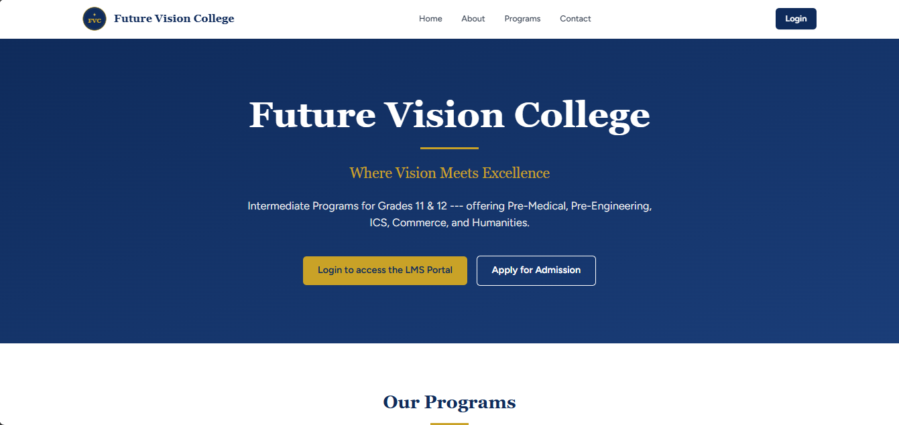
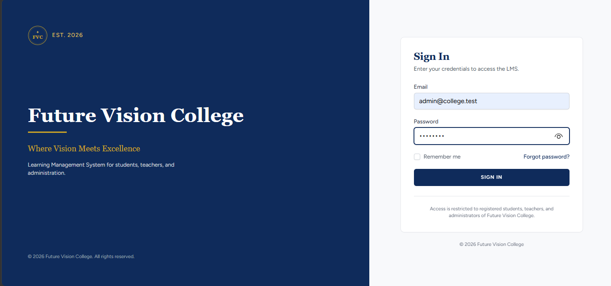
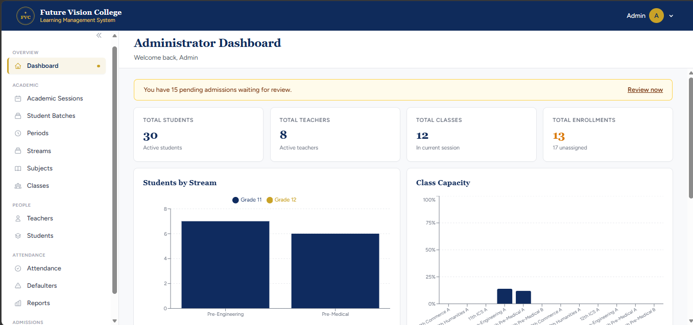
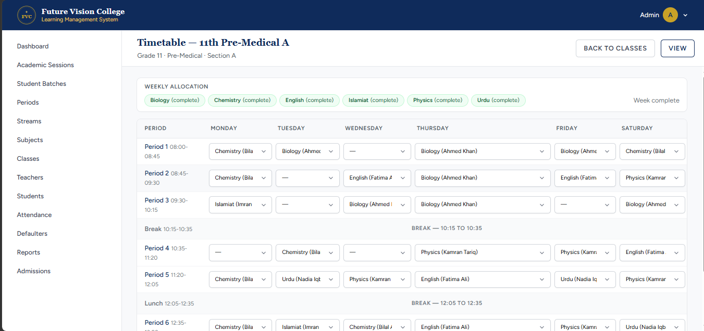
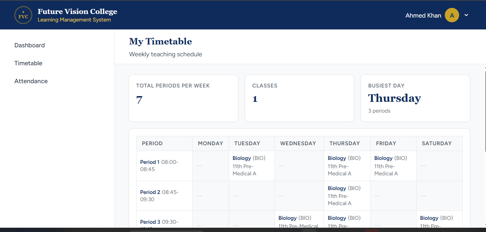

# Future Vision College — Learning Management System

A modern **Learning Management System (LMS)** for an intermediate college in Pakistan, covering Grades 11–12, academic management, student enrollment, attendance, timetables, admissions, and role-based portals.

> **Where Vision Meets Excellence**

## Features

- Role-based authentication: **Admin, Teacher, Student**
- Academic sessions, streams, subjects, classes, and sections
- Teacher and student management
- Class-subject-teacher assignments
- Weekly timetable management with conflict detection
- Student batches, profiles, admissions, and enrollment
- Student portal with timetable and attendance
- Period-wise student attendance marking
- Attendance reports, trends, and defaulter lists
- Admin dashboard with academic and attendance insights
- Public landing page and online admissions
- Responsive and print-friendly timetable views

## Screenshots

| Page | Preview |
|---|---|
| Landing |  |
| Login |  |
| Admin Dashboard |  |
| Timetable Builder |  |
| Teacher Timetable |  |

## Academic Streams

**Pre-Medical · Pre-Engineering · ICS · Commerce · Humanities**

## Tech Stack

| Layer | Technology |
|---|---|
| Backend | Laravel 13, PHP 8.5 |
| Frontend | React 19, TypeScript |
| Bridge | Inertia.js 2 |
| Styling | Tailwind CSS |
| Database | PostgreSQL 17 |
| Charts | Recharts |
| Build | Vite |
| Authentication | Laravel Breeze |
| Testing | PHPUnit |

## Requirements

- PHP 8.5+
- Composer 2.x
- Node.js 22+
- PostgreSQL 17+
- Git

## Installation

### 1. Clone

```cmd
git clone https://github.com/usman-dev56/college-lms.git
cd college-lms
```

### 2. Install dependencies

```cmd
composer install
npm install
```

### 3. Configure environment

```cmd
copy .env.example .env
php artisan key:generate
```

Update `.env` with your PostgreSQL credentials:

```env
APP_NAME="Future Vision College"
DB_CONNECTION=pgsql
DB_HOST=127.0.0.1
DB_PORT=5433
DB_DATABASE=college_lms_dev
DB_USERNAME=postgres
DB_PASSWORD=your_password
```

### 4. Create database and seed data

```cmd
psql -U postgres -c "CREATE DATABASE college_lms_dev;"
php artisan migrate
php artisan db:seed
```

### 5. Run the application

Terminal 1:

```cmd
npm run dev
```

Terminal 2:

```cmd
php artisan serve
```

Open **http://127.0.0.1:8000**

## Demo Credentials

| Role | Email | Password |
|---|---|---|
| Admin | `admin@college.test` | Configured in `.env` |
| Teacher | `ahmed.khan@college.test` | `teacher123` |
| Student | `ahmed.khan.16@college.test` | `student123` |

> Change demo credentials before production deployment.

## Project Structure

```text
college-lms/
├── app/              # Controllers, Models, Services
├── database/         # Migrations and Seeders
├── resources/        # React, Inertia, Views
├── routes/           # Application routes
├── tests/            # Feature and application tests
└── docs/screenshots/ # Project screenshots
```


## Testing

```cmd
npx tsc --noEmit
php artisan test
```

## Roadmap

- [x] Foundation & Authentication
- [x] Academic Structure
- [x] Students & Enrollment
- [x] Attendance
- [ ] Assessments & Report Cards
- [ ] Fees & Challans
- [ ] Board Registration & Results

## License

Released under the **Educational Use License**.

This project was built as a **learning exercise** to explore how a production-grade institutional LMS is designed and built. It is **not licensed for commercial use**. You are welcome to read, study, fork, and adapt the code for your own learning.

If you build something on top of this, attribution is appreciated but not required.

---

## Credits

**A learning project** — built to understand the architecture of a real institutional LMS for a Pakistani intermediate colleges.

- Not affiliated with any real college; **Future Vision College** is a fictional name used for demonstration.
- All student, teacher, and admission data used in the seeders is entirely fictional.
- Built with [Laravel](https://laravel.com), [React](https://react.dev), [Inertia.js](https://inertiajs.com), [Tailwind CSS](https://tailwindcss.com), and [Recharts](https://recharts.org).

*Where Vision Meets Excellence.*

---

## Contributing

This is a personal learning project. If you spot something interesting or want to share feedback, feel free to open an issue or start a discussion.

